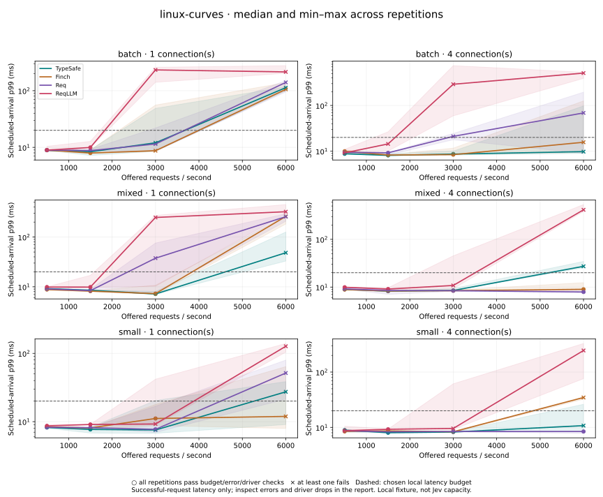
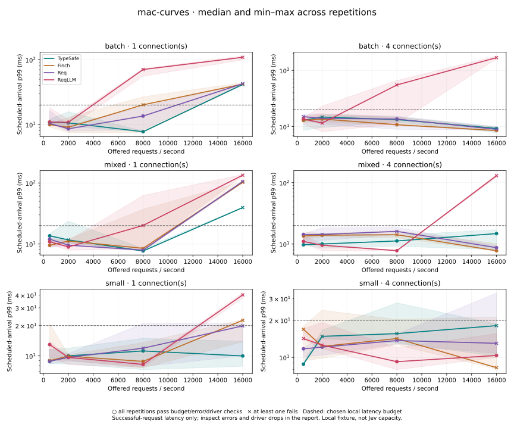

# Latency versus offered load — 2026-09-17

Follow-up: [the mixed-load investigation](MIXED.md) identifies driver heap/GC,
shared-host contention, and observed thermal throttling as contributors. It
preserves these historical results and does not attribute every outlier to one cause.

This report measures the current unreleased TypeSafe client against Finch, Req,
and ReqLLM at matched offered rates. It separates short local load screens,
longer local follow-ups, and a small real Jev comparison. None establishes a
universal fastest-client or production-capacity claim.

## Findings

**The evidence supports specific workload claims, not a universal fastest-client
claim.** TypeSafe passed every criterion in the Linux 30-second small-request
runs at 1500 offered req/s, with scheduled-arrival p99 7.31–7.38 ms. All four
clients passed that case. The macOS follow-up and the Linux mixed stress test
show why a throughput win cannot be treated as predictable latency everywhere.

The two-second Linux screen initially favored Finch and Req for mixed traffic at
6000 offered req/s / four connections: their p99 stayed below 13 ms while
TypeSafe's was 25–34 ms. **The longer follow-up did not preserve that ranking.**
TypeSafe completed more work with lower successful-request tail latency, but
its own p99 varied from 8.35 to 169.51 ms and two repetitions dropped offered
work. No adapter passed all three longer repetitions. Treat this as an overload
observation; it is not qualifying capacity or an isolated explanation of client
cost. Duration, process/fixture state, scheduling, and resource contention have
not been separated causally.

There were 7,740,000 locally offered requests across screens and follow-ups,
plus 128 measured real Jev calls and 16 live warmups. Failed/dropped work remains
in the results. The library was not changed to obtain these measurements.

## Thirty-second small-request follow-ups

Four connections, 256 state bytes, one question, synthetic 5 ms service delay,
three repetitions per client. Successful req/s includes drain time; p99 is from
scheduled arrival. Each cell reports median [min–max] of the run percentiles.

| Host / offered req/s | Client | Median successful req/s | p99 ms | Passing runs |
|---|---|---:|---:|---:|
| linux / 1500 | TypeSafe | 1499.7 | 7.36 [7.31–7.38] | 3/3 |
| linux / 1500 | Finch | 1499.7 | 7.45 [7.20–7.64] | 3/3 |
| linux / 1500 | Req | 1499.7 | 7.15 [7.14–7.15] | 3/3 |
| linux / 1500 | ReqLLM | 1499.7 | 9.27 [9.03–9.53] | 3/3 |
| mac / 2000 | TypeSafe | 1999.6 | 12.57 [11.76–19.57] | 2/3 |
| mac / 2000 | Finch | 1999.6 | 10.94 [10.65–13.00] | 3/3 |
| mac / 2000 | Req | 1999.6 | 13.34 [11.72–24.73] | 2/3 |
| mac / 2000 | ReqLLM | 1999.5 | 13.85 [13.67–30.65] | 2/3 |

All 1,260,000 calls in these follow-ups succeeded with zero driver drops. On
macOS, only Finch passed all checks. TypeSafe's third run stayed below 20 ms
p99 but exceeded the 5 ms driver-lag limit (5.787 ms); Req and ReqLLM each also
had a repetition exceeding both lag and latency limits. That prevents a clean
capacity claim from those configurations. It does not isolate the cause of the
variation. TypeSafe and Finch's Linux p99 ranges overlap; Req recorded a slightly
lower range in this particular case. There is no TypeSafe latency-lead claim here.

## Fifteen-second mixed stress follow-up

Linux, four connections, 6000 offered req/s, 9:1 small / 64 KiB requests,
three repetitions per client. Each client was offered 270,000 requests total.
These runs use the same harness and settings as the screen except duration and
the selected workload/rate. Adapter ordering is randomized in each block.

| Client | Median successful req/s | Scheduled-arrival p99 ms, median [range] | Completed / offered | Errors | Driver drops | Passing runs |
|---|---:|---:|---:|---:|---:|---:|
| TypeSafe | 5946.5 | 137.73 [8.35–169.51] | 266,259 / 270,000 | 0 | 3,741 | 1/3 |
| Finch | 4253.2 | 489.69 [462.42–543.81] | 190,993 / 270,000 | 0 | 79,007 | 0/3 |
| Req | 4142.0 | 529.85 [468.58–587.39] | 189,035 / 270,000 | 6 | 80,959 | 0/3 |
| ReqLLM | 2090.9 | 902.01 [806.89–941.59] | 98,763 / 270,000 | 1,513 | 169,724 | 0/3 |

The larger throughput figures do not turn these into latency-budget passes.
Drops are work the generator could not launch, not client rejections. These are
successful-request percentiles, not percentiles of all offered work. The
`request_errors` budget flag also marks missing successful completions from
such drops; actual error counts above come from `outcomes` alone. Req recorded
six transport errors and ReqLLM 1513 total-timeout outcomes. See the raw per-run
small/large-class percentiles before interpreting the combined distribution.

Before optimizing against this apparent bottleneck, separate fixture/generator
CPU contention from client behavior and capture latency over time, queue depth,
and per-worker profiles. The current results cannot attribute the duration-
dependent reversal to a specific TypeSafe or Finch implementation detail.

## Bounded live Jev comparison

All **144 service requests succeeded**, including warmup. This ran separately
from the macOS local sweeps, against `https://api.typesafe.ai`, with retries
disabled, one connection, the same synthetic invoice question, and 1 or 4
offered req/s. Every response identified `jev-1.13.0`. Observed usage including
warmup was 42,480 input / 3,024 output tokens. No request/response bodies or keys
are included in the evidence.

Across the client/rate groups, the median of each run's API p50 ranged from
108.25 to 149.66 ms; TypeSafe's was 123.70 ms at 1 req/s and 123.80 ms at 4 req/s.
There are only eight measured calls per run and two runs per client/rate. Their
p99 is effectively a maximum and is not a reliable tail estimate. These data
validate integration and observed end-to-end timing; they do not rank clients
or separate network/service time, possible service caching, and SDK overhead.
[Detailed live observations](LATENCY-DATA.md#mac-live-curves) retain every group.

## Curves, raw evidence, and supported wording

Plots show median and min–max of successful-request scheduled-arrival p99.
Circles mean every repetition passes; crosses mean at least one does not.
Connecting lines do not establish capacity between tested points. A low median
with a cross is not a clean pass. Driver drops and errors are in the linked tables.

Use the [complete tables](LATENCY-DATA.md),
[raw file checksums and commands](recorded/latency-manifest.json), and
[claim ledger](CLAIMS.md) when citing these results. Examples of supported wording:

- “In three 30-second local Linux runs, TypeSafe handled 1500 offered req/s with
  7.31–7.38 ms p99, four connections, 256-byte states, one question, and a synthetic
  5 ms service delay, without errors or drops.” Other tested clients also passed.
- “In the recorded 15-second local Linux mixed-load stress runs, TypeSafe completed
  more offered calls than the compared adapters; no adapter met the full 20 ms
  latency/driver criteria in all repetitions.” This is not Jev capacity.

The results do not support “fastest Jev client,” a production req/s guarantee, or
an assertion that local throughput improvements translate into equally large
live-service latency reductions.

## Method

The library source is unchanged from `34b59b6`; its fingerprint is
`28c985ae722d74f4bcee67d35c68c951f64e150b3b64aae64278b0ab0f3171c1`.
The new harness fingerprint, lock digest, runtime/dependency versions, commands,
raw-file checksums, and host details are recorded in
[latency-manifest.json](recorded/latency-manifest.json).

Local runs use verified TLS, HTTP/2, a separate Bandit BEAM with a 5 ms synthetic
sleep, and four schedulers per VM on the same physical host. macOS runs on an
Apple M4 Max; Linux runs on an Intel i5-1135G7. Both use Elixir 1.20.4 / OTP 29.0.6.
The clients are Mint 1.10.0, Finch 0.23.0, Req 0.7.4, and ReqLLM 1.24.0. Bandit is
1.12.5. Adapter differences are documented in the [README](README.md).

The screen uses one/four connections, three repetitions in seeded randomized
blocks, and two seconds of offered traffic per scenario (minimum 1000 samples).
Workloads are 256 bytes / one question, 16 KiB / 32 questions, and a 9:1 mix of
small requests with 64 KiB / one question. Offered rates are 500, 2000, 8000,
16000 req/s on macOS and 500, 1500, 3000, 6000 on Linux. These rates are a coarse
screen, not a search for an exact saturation boundary.

A pass requires **every offered request successful, zero driver drops, p99 launch
lag ≤5 ms, scheduled-arrival p99 ≤20 ms, and at least 99% of offered calls finished
within 20 ms** in every repetition. This is a chosen local budget, not a Jev
promise or application SLO. Capacity summaries use a contiguous passing prefix;
an isolated high-rate pass cannot erase a lower-rate failure. A highest-rate
pass provides no upper bound; no prefix means no qualifying observation.

The driver caps in-flight calls at 512. TypeSafe allows 128 active streams and
1024 queued calls per connection; Finch follows the fixture's 1024-stream peer
limit. All use the same connection budget, but saturation policies differ.
The fixture, load generator, and clients share CPU/memory. Driver-limited points
cannot establish service capacity. Successful-only latency must be read alongside
errors and drops, including the two classes in mixed workloads.

Memory snapshots are not peaks and CPU/GC include the entire client VM. The
millisecond driver timer contributes scheduling jitter. macOS had visible
background CPU activity during the screen (including Activity Monitor, a virtual
machine, and backup activity); repetitions and explicit driver checks preserve
that uncertainty rather than silently discarding it. Linux was a separate host,
not a dedicated or CPU-isolated benchmark appliance.

## Reproduction and claim policy

[README](README.md#latency-versus-offered-load) provides the commands and live
request cap. [CLAIMS.md](CLAIMS.md) lists supported wording and the requirements
for release comparisons. Reports retain every repetition; ranges below are
min–max of run percentiles, not confidence intervals or pooled percentiles.
