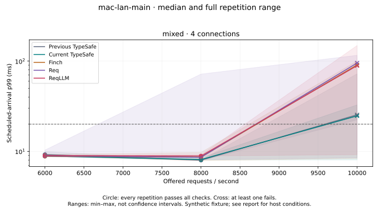

# Mac client, Linux fixture — 2026-09-17

This reverses the machines used in the [mixed-load investigation](MIXED.md):
the Mac runs the clients and arrival generator; Linux runs only the HTTPS fixture.
It also replaces SSH forwarding with direct HTTPS over wired Ethernet. This
is a change in forwarding, not evidence of a faster physical link: the earlier
SSH destination currently resolves over that same wired link, but its historical
route was not recorded. Machine roles and forwarding changed together, so their
individual effects cannot be separated from this comparison. The production
library was not changed for this experiment. A subsequent
[paired network experiment](NETWORK.md) holds Linux-client/Mac-fixture roles
fixed to compare direct and SSH-forwarded paths on the same wired link.

## Default-fixture results

The reversed setup supports a higher passing point for current TypeSafe in this
tested grid: **8,000 offered req/s**, with p99 **8.04–8.45 ms**, every request
successful and all criteria passing in three repetitions. Finch, ReqLLM, and
previous TypeSafe also pass at that point. Req has one failed 8,000 req/s run.
No variant passes all three 10,000 req/s repetitions. These are observations of
this setup, not a hardware-normalized improvement or a client capacity ceiling.

Scheduled-arrival p99 range and passing repetitions:

| Client | 6,000 req/s | 8,000 req/s | 10,000 req/s | Driver drops across all rates |
|---|---|---|---|---:|
| Previous TypeSafe | 8.97–9.93 ms; 3/3 | 7.86–8.00 ms; 3/3 | 22.36–72.25 ms; 0/3 | 2,543 |
| Current TypeSafe | 8.85–8.92 ms; 3/3 | 8.04–8.45 ms; 3/3 | 8.03–32.72 ms; 1/3 | 0 |
| Finch | 8.78–9.25 ms; 3/3 | 7.86–9.73 ms; 3/3 | 8.36–100.13 ms; 1/3 | 4,615 |
| Req | 8.69–10.34 ms; 3/3 | 8.07–71.83 ms; 2/3 | 8.48–115.97 ms; 1/3 | 6,840 |
| ReqLLM | 8.84–9.05 ms; 3/3 | 8.88–9.11 ms; 3/3 | 9.18–148.83 ms; 1/3 | 8,049 |

All launched requests succeeded. Drops are arrivals the bounded generator could
not launch; successful-only percentiles do not represent that missing work.
Current TypeSafe completed all 1,080,000 requests offered to it. Its lower overload
drops do not turn the failing 10,000 req/s repetitions into latency-budget passes.

At 8,000 req/s, current TypeSafe's median client-VM CPU cost was 98.8 ms per
1000 successful calls, versus 103.1 for previous TypeSafe and 114.5 for Finch.
All three completed every request at this point. Their ranges were 98.5–100.0,
100.4–103.8, and 108.1–115.8 ms respectively. This supports a scoped CPU-cost
observation; it is not a matching latency advantage. Previous TypeSafe's p99
range is slightly lower than current TypeSafe's at this point.

Lines connect tested points; they do not establish performance between them.
Shading is the full repetition range. A cross means at least one repetition
failed some screening criterion, even if its median p99 is below 20 ms.

## Fixture busy-wait control

Disabling scheduler busy-waiting **did not produce a consistently passing
10,000 req/s result**. All launched requests still succeeded; all variants
dropped some offered work across their three repetitions.

| Client | Scheduled-arrival p99 range | Passing runs | Driver drops |
|---|---:|---:|---:|
| Previous TypeSafe | 7.39–86.74 ms | 1/3 | 5,953 |
| Current TypeSafe | 73.20–75.31 ms | 0/3 | 7,513 |
| Finch | 138.14–222.55 ms | 0/3 | 24,890 |
| Req | 8.47–200.69 ms | 1/3 | 21,322 |
| ReqLLM | 10.00–137.18 ms | 1/3 | 16,651 |

The fixture still reached 100°C, with 1,454 new package-throttle events. Its
sampled process CPU averaged 310% and peaked near 398%; Mac thermal pressure
remained nominal. There were no new interface errors/drops. Throttle-event counts
are not a measure of throttling duration or severity. This control ran later and
offered 10,000 req/s continuously across cases, so it cannot establish that the
flag change caused the worse latency. It supplies no evidence to recommend the
setting as a fix; the benchmark's default fixture flags remain unchanged.

## What this establishes

The Mac-client arrangement is useful: it gives us passing 8,000 req/s mixed-load
observations for TypeSafe and repeatable measurements of client CPU cost. It
does not establish TypeSafe as the lowest-latency SDK or resolve fixture limits
at 10,000 req/s. The next maximum-capacity experiment needs a fixture with more
CPU/thermal headroom and a quieter client host; the existing 8,000 req/s data can
already support the narrower observations above.

## Method

- Client: Apple M4 Max, macOS 26.6.2, 16 physical/logical CPUs. Four BEAM schedulers
  per fresh client VM, as in the previous comparison. Ordinary desktop processes
  remained active; no applications were stopped or host power settings changed.
- Fixture: Intel i5-1135G7, Linux, four physical/eight logical CPUs; separate BEAM
  with four schedulers. Linux ran the fixture and its lightweight observer, with
  no benchmark client. The host retained its normal background processes.
- Network: Mac `10.0.0.2` → Linux `10.0.0.3`, wired `en7` → `enp88s0`. The Mac
  reports 1000baseT/full duplex; Linux reports a 2500 Mb/s interface speed. The
  effective link is bounded by the slower side. There is no benchmark SSH tunnel.
- TLS remains verified against the repository test CA and the certificate's
  `localhost` name. A per-client-VM `ERL_INETRC` file maps `localhost` to the Linux
  address. It does not change OS name resolution or disable certificate checks.
- Both VMs use Elixir 1.20.4 / OTP 29.0.6. The fixture uses Bandit 1.12.5, HTTP/2,
  small synthetic Noul responses, and a 5 ms sleep. No real Jev requests or keys.
- Versions: current TypeSafe is `341d824` (extended bounded uploads); previous
  TypeSafe is `4d9fff4`. Finch 0.23.0, Req 0.7.4, ReqLLM 1.24.0, Mint 1.10.0.
  Every variant uses the same current benchmark harness and dependency lock.
- Four connections, periodic nine 256-byte states / one 64 KiB state, one Noul
  question. TypeSafe allows 128 active streams and 1024 queued calls per connection;
  Finch has the same connection budget but its own admission semantics. The
  generator bounds in-flight calls at 512; request timeout is 1000 ms; retries
  are disabled. ReqLLM includes different SDK work and response handling, as
  described in [README](README.md#req-and-reqllm-adapters).

The main experiment uses three complete randomized blocks, seed 20260917,
15 seconds per scenario, and 6,000 / 8,000 / 10,000 offered req/s. Each scenario
starts a fresh client VM; the fixture remains running. There are 45 scenarios
and **5,400,000 offered requests**, excluding warmup. A separate 400-call network
smoke validates all four current adapters; the short TypeSafe pilot contributes
57,000 requests and is not used for claims.

The separate fixture-runtime control repeats all five variants at 10,000 req/s,
three 15-second runs each: **2,250,000 offered requests**. Its only intentional
configuration change for a matched 10,000 req/s scenario is restarting the Linux fixture with scheduler busy-waiting
disabled: `+S 4:4 +sbwt none +sbwtdcpu none +sbwtdio none`. Client flags, library
versions, network, workload, and budget criteria remain the same. This control
runs after the default-fixture matrix, rather than alternating fixture settings;
time/order/thermal-history effects therefore remain confounders. It also offers
10,000 req/s throughout, instead of interleaving lower rates as the main matrix
does, changing the host's sustained load history. It is a separate
single-rate comparison, not an extension of the earlier rate grid.

The same screening criteria apply: every offered request succeeds, zero driver
drops, at least 1000 successes, scheduled-arrival p99 ≤20 ms, launch-lag p99 ≤5 ms,
and ≥99% of offered work completed within 20 ms. Qualifying rates form a contiguous
passing prefix; passing the highest tested rate does not establish a maximum.

## Host observations and interpretation

Separate observers sample each machine every two seconds. The Mac observer uses
Foundation's thermal-pressure classification and host CPU counters; it does not
measure temperature. Linux observations include package temperature, changes in
hardware throttle counters, host/fixture CPU, and Ethernet bytes/error/drop
counters. CPU samples and per-case windows include startup, warmup, and result
aggregation; they are not exact request-only profiles. Short spikes can occur
between samples. The clocks were checked and approximately aligned.

During the default-fixture matrix, the Mac remained in **nominal thermal state**
throughout the samples. Whole-host CPU averaged about 41%, peaking at 63% in a
two-second interval, including background applications. Linux reached **100°C**
and recorded **7,041 new package-throttle events**. Its fixture averaged about
328% process CPU and peaked near 399%, where 100% means one logical CPU. The
observed Ethernet receive maximum was about 643 Mb/s, and interface error/drop
counters did not increase. These observations make fixture CPU/heat a material
limitation; they do not isolate the cause of every individual tail spike.

Do not compare these absolute capacities directly with the old local-host or
SSH-forwarded curves as if only the library changed. Faster client hardware,
network topology, server role, and background conditions all differ. The
current/previous TypeSafe comparison within this run holds that setup fixed.
Repetition ranges are full min–max ranges, not confidence intervals; overlapping
ranges do not establish a latency ranking. Thermally throttled server observations
cannot establish a stable hardware ceiling or rule out fixture-side delays.

## Evidence and reproduction

Read the [complete tables](MAC-CLIENT-DATA.md) and
[evidence manifest](recorded/mac-client/manifest.json). Each case retains outcomes,
driver drops/lag, both request classes, per-second latency buckets, VM CPU/memory,
source/harness fingerprints, and versions. Raw host samples and their derived
summary are included. Historical data have not been rewritten.

[README](README.md#direct-wired-fixture) gives the setup and commands. The benchmark
code change only adds an explicit fixture bind address, network provenance, and
host observation/reporting tools; it does not change the library or transport
adapters. Live service latency, real Jev throughput, different response sizes,
and long production soak behavior remain outside this experiment's scope.

Validation: 25 benchmark tests passed, all 400 direct-network smoke requests
succeeded with verified TLS across the four current adapters, and source hashes,
scenario completeness, outcome accounting, host-sample parsing, and evidence
checksums were checked. Both temporary fixture processes and host observers were
stopped after measurement. No production-library code or host power settings changed.
