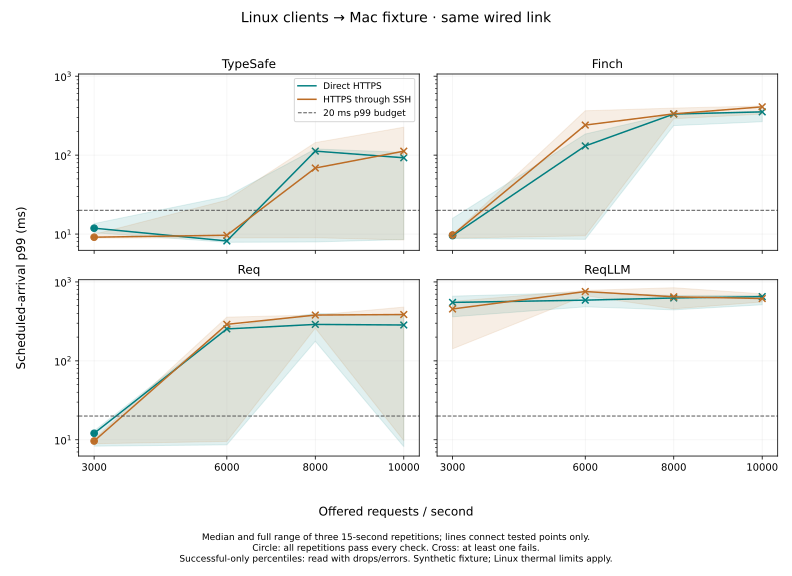

# Direct HTTPS versus SSH forwarding — Linux clients, Mac fixture

This experiment keeps the machine roles fixed and pairs direct HTTPS with
reverse SSH forwarding over the **same wired Ethernet link**. It tests the
forwarding path, rather than a change in physical link speed. It uses current
TypeSafe, Finch, Req and ReqLLM; no production library code changes are involved.

## Results

**Removing SSH forwarding did not raise any client's consistently passing rate
in this grid.** Direct networking often reduced overload drops, but did not
eliminate tail spikes. The physical link was the same in both conditions.

| Client | Highest qualifying direct rate | Highest qualifying SSH rate | Passing runs at 6000 req/s, direct / SSH |
|---|---:|---:|---:|
| TypeSafe | 3000 req/s | 3000 req/s | 2/3 / 2/3 |
| Finch | 3000 req/s | 3000 req/s | 1/3 / 1/3 |
| Req | 3000 req/s | 3000 req/s | 1/3 / 1/3 |
| ReqLLM | None in tested grid | None in tested grid | 0/3 / 0/3 |

“None” does not mean zero capacity: rates below 3000 were not measured in the
main experiment. Isolated higher passes do not qualify after a lower-rate failure.
The shared qualifying rate does not establish equal latency or equal capacity.

TypeSafe's detailed results (three 15-second repetitions per row):

| Offered req/s | Path | Scheduled-arrival p99 range | Median successful req/s | Driver drops across repetitions | Passing runs |
|---:|---|---:|---:|---:|---:|
| 3000 | Direct | 10.39–13.59 ms | 2998.5 | 0 | 3/3 |
| 3000 | SSH | 8.88–9.92 ms | 2998.4 | 0 | 3/3 |
| 6000 | Direct | 7.86–30.02 ms | 5997.1 | 0 | 2/3 |
| 6000 | SSH | 8.93–26.88 ms | 5996.5 | 0 | 2/3 |
| 8000 | Direct | 7.94–119.81 ms | 7833.3 | 5171 | 1/3 |
| 8000 | SSH | 8.98–144.27 ms | 7991.3 | 6999 | 1/3 |
| 10000 | Direct | 8.53–108.27 ms | 9636.4 | 14381 | 1/3 |
| 10000 | SSH | 8.41–225.91 ms | 9321.7 | 36832 | 1/3 |

Every launched TypeSafe request succeeded. At 6000 req/s it completed all 270,000
offered requests on each path, but the third repetition exceeded the 20 ms p99
budget on both. Direct was lower in the first two pairs and higher in the third.
At 3000, SSH had lower p99 in all three TypeSafe pairs. These results do not
support a universal direct-path latency improvement or a fastest-client claim.

Across all clients and both paths, 7,689,817 requests succeeded, 2,028,447 arrivals
were dropped by the bounded driver, and 1,736 launched requests failed. The errors
were 1,721 ReqLLM total-timeout outcomes and 15 Req generic transport outcomes;
the latter do not identify an underlying network failure. Finch and TypeSafe
had no launched-request errors. Dropped arrivals are not interface packet drops.



### Host observations

Linux ranged from **61 to 100°C** and recorded **7391 new package-throttle
counter increments**. Whole-host CPU averaged 46.4% across eight logical CPUs,
with a sampled maximum of 73.8%; a below-100% whole-host figure does not rule out
an individual scheduler, physical-core, or thermal limit. Mac thermal pressure
remained nominal, with whole-host CPU averaging 38.8% and peaking at 61.7%.

The Linux interface's maximum sampled transmit rate was about **610 Mb/s**;
receive peaked near 39 Mb/s. Interface error and drop counters did not increase.
These two-second samples do not rule out brief network bursts, but supply no
evidence of sustained 1 Gb/s link saturation. Linux's clock was about 134 ms
ahead of the Mac initially and 139 ms at the end (SSH clock-check RTT 172–191 ms).

The case sequence lasted about **29.3 minutes**. Host history matters: TypeSafe's
first 10000 req/s pair passed both paths, later repetitions failed; even its last
6000 req/s pair exceeded the latency budget. The observations establish that
instability persists without SSH, and thermal throttling remains a material
limitation. They do not prove that temperature caused each individual spike or
exclude fixture/background-process effects.

Use direct HTTPS for future transport benchmarks to remove the forwarding layer
from the measured path. This experiment does **not** justify promising higher
sustained capacity from that change alone. Establishing an SDK ceiling still
requires stable client CPU/thermal headroom and a validated arrival generator.
Historical passing points remain observations of their recorded runs; this
longer paired session does not reproduce a reliable 6000 req/s TypeSafe point.

## Evidence

The [complete tables](NETWORK-DATA.md) retain p50/p95/p99, successful throughput,
errors, driver drops/lag, client-VM CPU, and paired differences. The
[evidence manifest](recorded/network-pair/manifest.json) links the raw cases,
observers, setup, fingerprints and checksums. The comparison does not use
historical SSH numbers as its control: both conditions were measured anew.

## Method

The production source fingerprint is
`136ecd3ba154175eb62d0104325da5f882b530e4dbf5134a3afc06e4e14fd97e`, unchanged
from `b765eee`. Both hosts use Elixir 1.20.4 / OTP 29.0.6; dependencies are
Mint 1.10.0, Finch 0.23.0, Req 0.7.4, ReqLLM 1.24.0 and Bandit 1.12.5.

- Linux runs the client SDK and arrival generator. The Apple M4 Max Mac runs one
  persistent Bandit fixture. Both BEAMs use four schedulers. Each client case
  starts a fresh BEAM; no two benchmark clients run concurrently.
- Linux `10.0.0.3` / `enp88s0` and Mac `10.0.0.2` / `en7` communicate over their
  wired link. The Mac negotiates 1000baseT full duplex. Linux reports 2500 Mb/s;
  the physical path is limited by the Mac's 1 Gb/s link in both conditions.
- Direct cases connect to Mac `10.0.0.2:8454`. Forwarded cases connect to Linux
  `127.0.0.1:8454`; one reverse SSH session carries those connections to the
  same Mac fixture at `10.0.0.2:8454`. SSH binds its Mac source to `10.0.0.2`.
  The tunnel stays open but carries no benchmark traffic during direct cases.
- Both paths retain end-to-end HTTPS, the repository test CA, `verify_peer`,
  HTTP/2, and the certificate name `localhost`. Separate `ERL_INETRC` files
  change resolution only inside each client BEAM. No OS resolver changes.
- Four connections; nine 256-byte states followed by one 64 KiB state; one Noul
  question per request; fixture sleep 5 ms. TypeSafe permits 128 active streams
  and 1024 queued calls per connection. Other adapters retain their existing
  admission behavior. Driver limit 512; timeout 1000 ms; retries disabled.
- Offered rates are 3000, 6000, 8000 and 10000 req/s. Each case runs for 15 seconds,
  with three repetitions. There are 96 cases and 9,720,000 offered requests,
  excluding 16 warmup requests per case and the separate 800-call smoke.
- Three complete randomized blocks use seed 20260917. Each client/rate pair
  runs adjacent direct and forwarded cases. Its order reverses in the next
  repetition. Every block has eight direct-first and eight SSH-first pairs.
  Three repetitions imply a 2:1 first-order split within each combination.
- Budget criteria are unchanged: every offered call succeeds, no driver drops,
  at least 1000 successes, scheduled-arrival p99 ≤20 ms, launch-lag p99 ≤5 ms,
  and at least 99% of offered calls complete within 20 ms. A qualifying rate
  requires a contiguous prefix of tested rates passing in every repetition.

## Interpretation limits

Paired order reduces time and temperature confounding but cannot eliminate it.
The Linux laptop can thermally throttle; both hosts retain ordinary background
activity. The clients and load generator share a VM. Driver-limited outcomes do
not establish an SDK's maximum capacity. CPU cost in raw client reports excludes
SSH processes; the separate host observer includes the whole machine.

Removing forwarding changes several things together: SSH encryption and copying,
extra sockets and scheduling, and multiplexing four HTTP connections through one
SSH transport. This experiment estimates their combined effect; it does not
attribute any difference to one of those mechanisms.

The fixture is synthetic and has a fixed 5 ms sleep. These are not live Jev
latency or capacity results. ReqLLM also performs different SDK/model/response
work from the native-JSON TypeSafe, Finch and Req adapters. Successful-only
percentiles exclude dropped arrivals and must be read with their counts.

Host observers sample every two seconds. Linux records temperature, throttle
counters, host CPU, and interface bytes/errors/drops. Mac records host CPU and
thermal pressure, not temperature. Case windows include startup, warmup and
aggregation, with approximate cross-host clock alignment. Throttle counts do
not measure throttling duration or severity; brief spikes may fall between
samples. Repetition ranges are min–max, not confidence intervals.

## Reproduction

On the Mac, from `bench/`, start the fixture and tunnel in separate terminals:

```sh
ERL_FLAGS='+S 4:4' BENCH_BIND_IP=10.0.0.2 BENCH_PORT=8454 mix run server.exs
ssh -N -T -o ExitOnForwardFailure=yes -o ControlMaster=no -o ControlPath=none \
  -b 10.0.0.2 -R 127.0.0.1:8454:10.0.0.2:8454 linux
```

On Linux, create two resolver files in `bench/results/network-pair/`.
`direct.inetrc` contains:

```erlang
{lookup, [file]}.
{host, {10,0,0,2}, ["localhost"]}.
```

`ssh.inetrc` contains:

```erlang
{lookup, [file]}.
{host, {127,0,0,1}, ["localhost"]}.
```

From Linux `bench/`, with the recorded Elixir/OTP versions on `PATH`:

```sh
ERL_FLAGS='+S 4:4' BENCH_PORT=8454 python3 mixed_comparison.py \
  --clients typesafe,finch,req,req_llm --rates 3000,6000,8000,10000 \
  --seconds 15 --repetitions 3 \
  --network-pair results/network-pair/direct.inetrc results/network-pair/ssh.inetrc \
  --output results/network-pair/paired
```

Use a fresh output directory for each experiment. Compile dependencies and run
correctness checks before timing. Start `monitor_linux.py` without `--pid` for
whole-host client observations, and the compiled `monitor_mac.swift` observer
on the Mac. Record the clock offset before and after. Stop only the fixture,
tunnel and observers created for this experiment after completion.

`summarize_network.py MANIFEST --output REPORT.md --hosts --plot` validates pairs and
accounting, writes separate path manifests and paired differences, and joins
adjacent `linux-monitor.jsonl`, `mac-monitor.jsonl`, and `clock-start.json` files.
The optional plot requires the dependencies in `requirements-plots.txt`.

Validation: 25 benchmark tests passed before timing. Both paths passed the
800-call smoke. All 96 cases, 48 pairs, repetitions, source/harness/dependency
fingerprints, and per-second/payload-class accounting were verified. Malformed
evidence checks reject incomplete runs, missing counterparts, duplicate cases
and incorrect accounting. The fixture, tunnel and observers were stopped after
measurement. No production-library or host power-setting changes were made.
